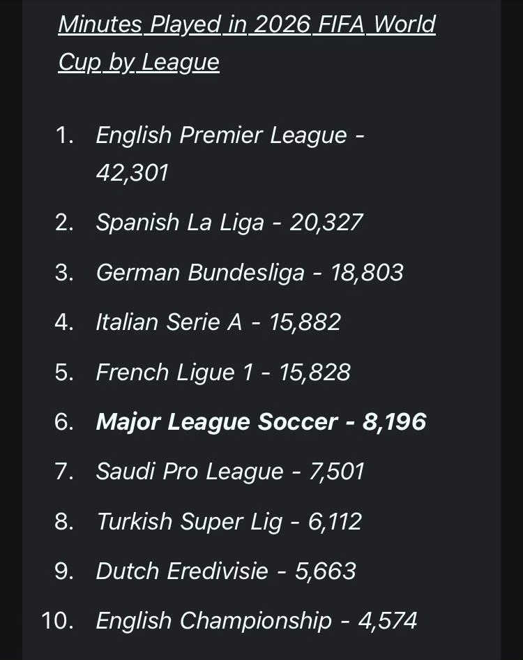

```{python}
#| label: setup
#| include: false

import json
import os

import altair as alt
import numpy as np
import pandas as pd
import footy
from scipy import stats as scipy_stats

# ── Data paths ────────────────────────────────────────────────────────────────
WC_DATA  = "../world-cup-2026-leagues/data"
EPL_DATA = "../../../../epl-standings/data/standings_verified.json"

for f in ["wc_players.csv", "wc_leagues.csv"]:
    if not os.path.exists(f"{WC_DATA}/{f}"):
        raise FileNotFoundError(f"Missing {WC_DATA}/{f} — run fetch_wc_data.py")
if not os.path.exists(EPL_DATA):
    raise FileNotFoundError(f"Missing {EPL_DATA}")

# ── footy helpers ─────────────────────────────────────────────────────────────
def _colour(name: str) -> str:
    """Return the official hex brand colour for a club, or grey if unknown."""
    try:
        return footy.colour(footy.normalise(name))
    except KeyError:
        return "#AAAAAA"

def _logo(name: str) -> str:
    """Return the logo URL for a club, or empty string if unknown."""
    try:
        return footy.logo(footy.normalise(name)) or ""
    except KeyError:
        return ""

_LIGHTEN_BARS = {"#c8102e", "#cc0000", "#dd0000"}   # Liverpool, Fulham, Nottm Forest — all-red badges; Fulham/Forest pair collapses under protanopia

def _bar_colour(name: str) -> str:
    """Lighten bars where the badge is all-red and blends with a dark-red background."""
    hex_c = _colour(name)
    if hex_c.lower() in _LIGHTEN_BARS:
        r, g, b = int(hex_c[1:3], 16), int(hex_c[3:5], 16), int(hex_c[5:7], 16)
        f = 0.70
        return f"#{int(r + f*(255-r)):02x}{int(g + f*(255-g)):02x}{int(b + f*(255-b)):02x}"
    return hex_c

# ── Load WC player data ───────────────────────────────────────────────────────
players = pd.read_csv(f"{WC_DATA}/wc_players.csv")
epl_players = players[players["league"] == "EPL"].copy()
epl_players["club"] = epl_players["club"].str.replace(r"^\d+\. ", "", regex=True).str.strip()

# ── Load EPL standings (2025/26) ──────────────────────────────────────────────
with open(EPL_DATA) as f:
    standings_raw = json.load(f)

latest_season = list(standings_raw.keys())[-1]
final_table = (
    pd.DataFrame.from_dict(standings_raw[latest_season], orient="index",
                           columns=["position"])
    .reset_index()
    .rename(columns={"index": "club"})
    .sort_values("position")
)

# ── Club aggregation ──────────────────────────────────────────────────────────
club_stats = (
    epl_players
    .groupby("club")
    .agg(
        wc_minutes  =("minutes",  "sum"),
        wc_goals    =("goals",    "sum"),
        wc_assists  =("assists",  "sum"),
        player_count=("nation",   "count"),
    )
    .reset_index()
    .sort_values("wc_minutes", ascending=False)
)
nineties = club_stats["wc_minutes"] / 90
club_stats["ga_per90"] = ((club_stats["wc_goals"] + club_stats["wc_assists"]) / nineties).round(2)
club_stats["colour"]   = club_stats["club"].apply(_bar_colour)
club_stats["logo"]     = club_stats["club"].apply(_logo)

# ── Merge EPL table position ──────────────────────────────────────────────────
final_table["club_lower"] = final_table["club"].str.lower().str.strip()
club_stats["club_lower"]  = club_stats["club"].str.lower().str.strip()

# FBref uses short names; EPL table uses full names — map before merge
FBREF_TO_EPL = {
    "manchester utd":   "manchester united",
    "brighton":         "brighton & hove albion",
    "nottingham":       "nottingham forest",
    "newcastle":        "newcastle united",
    "wolves":           "wolverhampton wanderers",
    "tottenham":        "tottenham hotspur",
    "west ham":         "west ham united",
}
club_stats["club_lower"] = club_stats["club_lower"].map(FBREF_TO_EPL).fillna(
    club_stats["club_lower"]
)

merged = club_stats.merge(
    final_table[["club_lower", "position", "club"]],
    on="club_lower", how="left",
    suffixes=("_fbref", "_epl"),
)
merged["display_name"] = merged["club_epl"].fillna(merged["club_fbref"])
merged["logo"]         = merged["club_fbref"].apply(_logo)
merged["colour"]       = merged["club_fbref"].apply(_bar_colour)

# ── Nation breakdown within each club ────────────────────────────────────────
NATION_FLAGS = {
    "Algeria":        "🇩🇿",
    "Argentina":      "🇦🇷",
    "Australia":      "🇦🇺",
    "Austria":        "🇦🇹",
    "Belgium":        "🇧🇪",
    "Bosnia–Herz":    "🇧🇦",
    "Brazil":         "🇧🇷",
    "Canada":         "🇨🇦",
    "Colombia":       "🇨🇴",
    "Congo DR":       "🇨🇩",
    "Croatia":        "🇭🇷",
    "Curaçao":        "🇨🇼",
    "Côte d'Ivoire":  "🇨🇮",
    "Czechia":        "🇨🇿",
    "Ecuador":        "🇪🇨",
    "Egypt":          "🇪🇬",
    "England":        "🏴󠁧󠁢󠁥󠁮󠁧󠁿",
    "France":         "🇫🇷",
    "Germany":        "🇩🇪",
    "Ghana":          "🇬🇭",
    "Haiti":          "🇭🇹",
    "Iraq":           "🇮🇶",
    "Japan":          "🇯🇵",
    "Korea Republic": "🇰🇷",
    "Mexico":         "🇲🇽",
    "Morocco":        "🇲🇦",
    "Netherlands":    "🇳🇱",
    "New Zealand":    "🇳🇿",
    "Norway":         "🇳🇴",
    "Panama":         "🇵🇦",
    "Paraguay":       "🇵🇾",
    "Portugal":       "🇵🇹",
    "Scotland":       "🏴󠁧󠁢󠁳󠁣󠁴󠁿",
    "Senegal":        "🇸🇳",
    "South Africa":   "🇿🇦",
    "Spain":          "🇪🇸",
    "Sweden":         "🇸🇪",
    "Switzerland":    "🇨🇭",
    "Tunisia":        "🇹🇳",
    "Türkiye":        "🇹🇷",
    "United States":  "🇺🇸",
    "Uruguay":        "🇺🇾",
    "Uzbekistan":     "🇺🇿",
    "Other":          "🌍",
}
TOP_NATIONS = 5    # top-5 nations shown individually; all others → "Other"
TOP_CLUBS   = 15

nation_by_club = (
    epl_players
    .groupby(["club", "nation"])
    .agg(minutes=("minutes", "sum"), player_count=("nation", "count"))
    .reset_index()
)
club_name_map   = merged.set_index("club_fbref")["display_name"].to_dict()
club_colour_map = merged.set_index("club_fbref")["colour"].to_dict()
nation_by_club["display_name"] = nation_by_club["club"].map(club_name_map).fillna(nation_by_club["club"])
nation_by_club["club_colour"]  = nation_by_club["club"].map(club_colour_map).fillna("#AAAAAA")

top_club_list    = club_stats.nlargest(TOP_CLUBS, "wc_minutes")["club"].tolist()
top_club_display = [club_name_map.get(c, c) for c in top_club_list]
top_nations      = set(
    epl_players.groupby("nation")["minutes"].sum()
    .sort_values(ascending=False).head(TOP_NATIONS).index
)

nbc_filtered = nation_by_club[nation_by_club["club"].isin(top_club_list)].copy()
nbc_filtered["nation_label"] = nbc_filtered["nation"].where(
    nbc_filtered["nation"].isin(top_nations), "Other"
)
MIN_SEGMENT = 90   # per-club nation segments below this are folded into "Other"

nbc_agg_raw = (
    nbc_filtered
    .groupby(["display_name", "nation_label"])
    .agg(minutes=("minutes", "sum"), player_count=("player_count", "sum"))
    .reset_index()
)
nbc_agg_raw.loc[nbc_agg_raw["minutes"] < MIN_SEGMENT, "nation_label"] = "Other"
nbc_agg = (
    nbc_agg_raw
    .groupby(["display_name", "nation_label"])
    .agg(minutes=("minutes", "sum"), player_count=("player_count", "sum"))
    .reset_index()
)
nbc_agg["nation_flag"] = nbc_agg["nation_label"].map(NATION_FLAGS).fillna("🌐") + " " + nbc_agg["nation_label"]
nbc_agg["flag_only"]  = nbc_agg["nation_label"].map(NATION_FLAGS).fillna("🌐")

# Cumulative x positions so flag emoji can be centred inside each stacked segment
nbc_sorted = (
    nbc_agg
    .sort_values(["display_name", "minutes"], ascending=[True, False])
    .copy()
)
nbc_sorted["x_end"]   = nbc_sorted.groupby("display_name")["minutes"].cumsum()
nbc_sorted["x_start"] = nbc_sorted["x_end"] - nbc_sorted["minutes"]
nbc_sorted["x_mid"]   = (nbc_sorted["x_start"] + nbc_sorted["x_end"]) / 2

# ── Player detail ─────────────────────────────────────────────────────────────
player_detail = (
    epl_players[["player", "nation", "club", "minutes", "goals", "assists", "position"]]
    .assign(ga=lambda d: d["goals"] + d["assists"])
    .rename(columns={"player": "Player", "nation": "Nation", "club": "Club",
                     "minutes": "Min", "goals": "G", "assists": "A",
                     "ga": "G+A", "position": "Pos"})
    .sort_values("Min", ascending=False)
    .reset_index(drop=True)
)
# Apply logo/colour while Club still holds FBref names (footy knows them)
player_detail["colour"]      = player_detail["Club"].apply(_bar_colour)
player_detail["logo"]        = player_detail["Club"].apply(_logo)
# Then remap to EPL display names
player_detail["Club"]        = player_detail["Club"].map(club_name_map).fillna(player_detail["Club"])
player_detail["nation_flag"] = player_detail["Nation"].map(NATION_FLAGS).fillna("🌐")
player_detail["Player_flag"] = player_detail["Player"] + "  " + player_detail["nation_flag"]

# ── Players with G+A > 0 for production dropdown ─────────────────────────────
ga_players = (
    epl_players[epl_players["goals"] + epl_players["assists"] > 0]
    .copy()
    .rename(columns={"player": "Player", "nation": "Nation", "club": "Club",
                     "minutes": "Min", "goals": "G", "assists": "A",
                     "position": "Pos"})
)
ga_players["G+A"]        = ga_players["G"] + ga_players["A"]
ga_players["nineties"]   = ga_players["Min"] / 90
ga_players["ga_per90"]   = (ga_players["G+A"] / ga_players["nineties"]).round(2)
ga_players["colour"]     = ga_players["Club"].apply(_bar_colour)
ga_players["logo"]       = ga_players["Club"].apply(_logo)
ga_players["Club"]       = ga_players["Club"].map(club_name_map).fillna(ga_players["Club"])
ga_players["nation_flag"]  = ga_players["Nation"].map(NATION_FLAGS).fillna("🌐")
ga_players["Player_flag"]  = ga_players["Player"] + "  " + ga_players["nation_flag"]

# ── Pre-compute linear regression for scatter annotation ─────────────────────
_reg_data = merged[merged["position"].notna() & (merged["wc_minutes"] >= 0)].copy()
_reg_data["position"] = _reg_data["position"].astype(int)
_slope, _intercept, _r, _p, _ = scipy_stats.linregress(
    _reg_data["position"], _reg_data["wc_minutes"]
)
_r2 = _r ** 2
_x = np.array([1, 20])
_reg_line = pd.DataFrame({"position": _x,
                          "wc_minutes": _slope * _x + _intercept})
```

While within Premier league rivalries burn hotter than a circle of hell in Dante's Inferno,
the 2026 World Cup presented the rare occasion where Premier League rivals combine on the field as teammates on a national team and in the stands singing for country.
And for fans of the English Premier League (EPL) and international club soccer like myself, this World Cup was also an opportunity to test the relative quality of leagues in a different way from the normal Champions League competitions.
At the end of the tournament, I saw the following screenshot in my social media feed that tickled my analytical brain:

{width=40% fig-align="center"}
 
The Premier League sent more minutes to the 2026 World Cup than La Liga and
the Bundesliga combined. That is striking. But "the Premier League" is not a
team. It is twenty clubs with different ownership models, scouting
geographies, and squad philosophies. Arsenal's international roster looks
nothing like Sunderland's. Manchester City's player pool spans six continents.
Brighton punches well above its wage bill. These differences matter, and a
single aggregate obscures all of them.

This post breaks the EPL's World Cup contribution down by club, looks at
which national teams those minutes came from, and asks whether a club's
2025/26 league finish predicted how internationally active its squad was.
The league-level picture is in the
[previous post in this series](../world-cup-2026-leagues/).
The 34-year EPL trajectory is in the [EPL Standings post](../epl-standings/).

---

## Which clubs contributed the most?

```{python}
#| label: chart-epl-club-minutes
#| fig-cap: "Total World Cup minutes by EPL club. Club logo centred in each bar; minutes shown in parentheses at the bar end."

top_clubs = merged[merged["wc_minutes"] > 0].nlargest(20, "wc_minutes").copy()
top_clubs["min_label"] = top_clubs["wc_minutes"].apply(lambda x: f"({x:,})")
sort_field = alt.EncodingSortField(field="wc_minutes", order="descending")

base = alt.Chart(top_clubs)

bars = base.mark_bar().encode(
    x=alt.X("wc_minutes:Q",
            axis=alt.Axis(title="Total World Cup minutes", format=",d")),
    y=alt.Y("display_name:N", sort=sort_field,
            axis=alt.Axis(title=None, labelPadding=28)),
    color=alt.Color("colour:N", scale=None, legend=None),
    tooltip=[
        alt.Tooltip("display_name:N", title="Club"),
        alt.Tooltip("wc_minutes:Q",   title="WC minutes",  format=",d"),
        alt.Tooltip("player_count:Q", title="Players"),
        alt.Tooltip("wc_goals:Q",     title="Goals"),
        alt.Tooltip("wc_assists:Q",   title="Assists"),
        alt.Tooltip("ga_per90:Q",     title="G+A per 90",  format=".2f"),
        alt.Tooltip("position:Q",     title="EPL position"),
    ],
)

# Logo next to y-axis label — outside bar on white background
axis_logos = base.mark_image(width=20, height=20, clip=False).encode(
    x=alt.value(-15),
    y=alt.Y("display_name:N", sort=sort_field),
    url="logo:N",
    tooltip=[
        alt.Tooltip("display_name:N", title="Club"),
        alt.Tooltip("wc_minutes:Q",   title="WC minutes", format=",d"),
    ],
)

# Minutes in parentheses at the bar end
end_labels = base.mark_text(align="left", dx=5, fontSize=10,
                             color="#333333").encode(
    x=alt.X("wc_minutes:Q"),
    y=alt.Y("display_name:N", sort=sort_field),
    text="min_label:N",
)

(bars + axis_logos + end_labels).properties(
    width=620, height=520,
    title="Manchester City and Arsenal Led the EPL's World Cup Contribution"
).interactive()
```

Manchester City and Arsenal at the top looks right. Both clubs recruit
globally and their squads reflect that. City's Argentine spine, Arsenal's
Brazilian and Ivorian contingent, Liverpool's South American core. These
clubs built for sustained European competition, which means building rosters
heavy with established internationals.

I think the more interesting story is in the middle of this chart. Sunderland
at sixth, Crystal Palace and Fulham in the top ten. Those clubs finished mid-
to-lower table in 2025/26. Their World Cup contribution suggests that for
some squads, the international pipeline runs somewhat independently of league
performance. Worth looking at who those minutes actually came from (we will later).

---

## Where did those minutes come from? National breakdown by club

The chart above shows volume per club. This one breaks each club's
contribution down by which national team the players represented. The five
nations with the most World Cup minutes across EPL-based players are shown
individually. Every other country is grouped as Other.

```{python}
#| label: chart-nation-stacked
#| fig-cap: "World Cup minutes by EPL club, stacked by national team. Flag emoji centred in each segment; legend shows flags only (no colour blocks)."

flag_order = (
    [NATION_FLAGS.get(n, "🌐") + " " + n for n in
     sorted(top_nations,
            key=lambda n: -epl_players[epl_players["nation"]==n]["minutes"].sum())]
    + ["🌍 Other"]
)
# Only keep nations that actually appear in nbc_agg (after MIN_SEGMENT filter)
actual_flag_order = [f for f in flag_order if f in nbc_agg["nation_flag"].values]

# Club logo data for y-axis (one row per club)
_stacked_logo_df = (
    merged[merged["display_name"].isin(top_club_display)]
    [["display_name", "logo"]].drop_duplicates("display_name")
)

# Stacked bars — Vega-Lite handles the stacking; segments ordered largest-first
nation_bars = alt.Chart(nbc_agg).mark_bar().encode(
    x=alt.X("minutes:Q",
            axis=alt.Axis(title="World Cup minutes", format=",d")),
    y=alt.Y("display_name:N", sort=top_club_display,
            axis=alt.Axis(title=None, labelPadding=28)),
    color=alt.Color(
        "nation_flag:N",
        sort=actual_flag_order,
        scale=alt.Scale(scheme="tableau20"),
        legend=None,
    ),
    order=alt.Order("minutes:Q", sort="descending"),
    tooltip=[
        alt.Tooltip("display_name:N", title="Club"),
        alt.Tooltip("nation_flag:N",  title="Nation"),
        alt.Tooltip("minutes:Q",      title="Minutes", format=",d"),
        alt.Tooltip("player_count:Q", title="Players"),
    ],
)

# Flag emoji centred in each segment using pre-computed x_mid positions
flag_text = alt.Chart(nbc_sorted).mark_text(fontSize=13, baseline="middle").encode(
    x=alt.X("x_mid:Q"),
    y=alt.Y("display_name:N", sort=top_club_display),
    text="flag_only:N",
    opacity=alt.condition(
        alt.datum.minutes >= 200,
        alt.value(1), alt.value(0)
    ),
    tooltip=[
        alt.Tooltip("display_name:N", title="Club"),
        alt.Tooltip("nation_flag:N",  title="Nation"),
        alt.Tooltip("minutes:Q",      title="Minutes", format=",d"),
    ],
)

# Club logo next to each y-axis label
stacked_axis_logos = (
    alt.Chart(_stacked_logo_df)
    .mark_image(width=20, height=20, clip=False)
    .encode(
        x=alt.value(-15),
        y=alt.Y("display_name:N", sort=top_club_display),
        url="logo:N",
    )
)

main_stacked = (nation_bars + flag_text + stacked_axis_logos).properties(
    width=680, height=480,
    title="England Dominated Most Club Squads, but International Spread Varies"
).interactive()

# Standalone legend: flag emoji as the symbol, country name as the label
_flag_only    = [f.split(" ")[0] for f in actual_flag_order]
_country_only = [" ".join(f.split(" ")[1:]) for f in actual_flag_order]
_legend_df = pd.DataFrame({
    "flag":    _flag_only,
    "country": _country_only,
    "order":   list(range(len(actual_flag_order))),
})

legend_strip = (
    alt.Chart(_legend_df)
    .mark_text(fontSize=20, baseline="middle")
    .encode(
        x=alt.X("country:N",
                sort=_country_only,
                axis=alt.Axis(title=None, labelAngle=-30, labelFontSize=10,
                              ticks=False, domain=False, labelPadding=6)),
        text="flag:N",
    )
    .properties(width=680, height=52)
)

alt.vconcat(main_stacked, legend_strip, spacing=4)
```

A few things stand out here. England leads for most clubs, as you'd expect
from domestic players who qualified. For instance, a club like Sunderland
with a lower wage bill may still have a cluster of English or Northern
European internationals that pushes its total up. Argentina, Netherlands, and
Brazil appear across multiple clubs, which reflects how broadly those nations
recruit talent at the top of the market.

A caution: the breakdown reflects squad composition at the time of the
tournament, not a deliberate diversification strategy. Clubs do not pick
players to maximize nation coverage. The pattern emerges from transfer
decisions made years earlier.

---

## Who are these players?

```{python}
#| label: chart-players
#| fig-cap: "EPL players at the 2026 World Cup, sorted by minutes. Bar colour and logo are the club's."

top60 = player_detail.head(60).copy()
p_sort = alt.EncodingSortField(field="Min", order="descending")

p_bars = (
    alt.Chart(top60)
    .mark_bar()
    .encode(
        x=alt.X("Min:Q",
                axis=alt.Axis(title="World Cup minutes", format=",d")),
        y=alt.Y("Player_flag:N", sort=p_sort,
                axis=alt.Axis(title=None, labelLimit=200)),
        color=alt.Color("colour:N", scale=None, legend=None),
        tooltip=[
            alt.Tooltip("Player:N",  title="Player"),
            alt.Tooltip("Nation:N",  title="Nation"),
            alt.Tooltip("Club:N",    title="Club"),
            alt.Tooltip("Pos:N",     title="Position"),
            alt.Tooltip("Min:Q",     title="Minutes", format=",d"),
            alt.Tooltip("G:Q",       title="Goals"),
            alt.Tooltip("A:Q",       title="Assists"),
            alt.Tooltip("G+A:Q",     title="G+A"),
        ],
    )
)

p_logos = (
    alt.Chart(top60)
    .mark_image(width=18, height=18, stroke="white", strokeWidth=1.5)
    .encode(
        x=alt.value(9),
        y=alt.Y("Player_flag:N", sort=p_sort),
        url="logo:N",
        tooltip=[
            alt.Tooltip("Player:N", title="Player"),
            alt.Tooltip("Club:N",   title="Club"),
            alt.Tooltip("Nation:N", title="Nation"),
        ],
    )
)

(p_bars + p_logos).properties(
    width=640, height=980,
    title="EPL Players at the 2026 World Cup (top 60 by minutes)"
).interactive()
```

Hover any bar to see the player's nation, club, position, and goal
contributions. The bar colour and logo are the club's. Bars sharing the
same colour came from the same side.

---

## Does league position predict World Cup contribution?

Better clubs should send more World Cup players. Richer squads (in talent and finances) will probably have deeper
international pipelines. Or at least that's the intuition. The chart below tests it,
with each club shown as its own badge.

```{python}
#| label: chart-scatter-position-minutes
#| fig-cap: "EPL final position vs. World Cup minutes per club. Each logo is one club."

scatter_data = _reg_data.copy()

logos_scatter = (
    alt.Chart(scatter_data)
    .mark_image(width=32, height=32)
    .encode(
        x=alt.X("position:Q",
                scale=alt.Scale(domain=[0, 21]),
                axis=alt.Axis(title="2025/26 EPL final position (1 = champion)",
                              values=list(range(1, 21)))),
        y=alt.Y("wc_minutes:Q",
                axis=alt.Axis(title="World Cup minutes", format=",d")),
        url="logo:N",
        tooltip=[
            alt.Tooltip("display_name:N", title="Club"),
            alt.Tooltip("position:Q",     title="EPL position"),
            alt.Tooltip("wc_minutes:Q",   title="WC minutes",  format=",d"),
            alt.Tooltip("player_count:Q", title="Players"),
            alt.Tooltip("ga_per90:Q",     title="G+A per 90",  format=".2f"),
        ],
    )
)

trend = (
    alt.Chart(_reg_line)
    .mark_line(color="#CC0000", strokeDash=[5, 3], opacity=0.7)
    .encode(x=alt.X("position:Q"), y=alt.Y("wc_minutes:Q"))
)

_ols_caption = (
    f"OLS: slope = {_slope:.0f} min per table place  ·  "
    f"R² = {_r2:.2f}  ·  p = {_p:.3f}"
)

(logos_scatter + trend).properties(
    width=620, height=440,
    title=alt.TitleParams(
        "Higher EPL Finish Correlates with Greater World Cup Contribution",
        subtitle=[_ols_caption],
        subtitleColor="#CC0000",
        subtitleFontSize=10,
        subtitleFontStyle="italic",
    )
).interactive()
```

The trend line direction tells one story. The outlier logos tell a better
one. A badge sitting far above the trend at a high position number (lower in
the table) has a squad built around a cluster of internationals from a nation
that ran deep in the tournament. A top-four badge sitting low on the y-axis
likely leaned on English players who either did not qualify or exited early.

Worth noting: the trend captures correlation, not causation. Top clubs
recruit established internationals partly because they can pay for them, and
those players tend to stay on international rosters. The league position may
be a proxy for wage bill rather than an independent signal.

---

## Production, not just presence

All men are created equal, but all minutes are not. Goals and assists per 90 are contribution.

```{python}
#| label: chart-epl-club-ga-overview
#| fig-cap: "G+A per 90 by EPL club at the 2026 World Cup. Minimum 200 WC minutes to suppress small-sample noise. Club logo at bar start."

ga_clubs = merged[merged["wc_minutes"] >= 200].nlargest(15, "ga_per90").copy()
ga_clubs["ga_label"] = ga_clubs["ga_per90"].apply(lambda x: f"{x:.2f}")
ga_sort = alt.EncodingSortField(field="ga_per90", order="descending")

ga_base = alt.Chart(ga_clubs)

ga_bars = ga_base.mark_bar().encode(
    x=alt.X("ga_per90:Q",
            axis=alt.Axis(title="Goals + assists per 90 min")),
    y=alt.Y("display_name:N", sort=ga_sort, axis=alt.Axis(title=None)),
    color=alt.Color("colour:N", scale=None, legend=None),
    tooltip=[
        alt.Tooltip("display_name:N", title="Club"),
        alt.Tooltip("ga_per90:Q",     title="G+A per 90",  format=".2f"),
        alt.Tooltip("wc_goals:Q",     title="Goals"),
        alt.Tooltip("wc_assists:Q",   title="Assists"),
        alt.Tooltip("wc_minutes:Q",   title="WC minutes",  format=",d"),
        alt.Tooltip("player_count:Q", title="Players"),
    ],
)

ga_logos = ga_base.mark_image(width=22, height=22, stroke="white", strokeWidth=1.5).encode(
    x=alt.value(11),
    y=alt.Y("display_name:N", sort=ga_sort),
    url="logo:N",
    tooltip=[alt.Tooltip("display_name:N", title="Club")],
)

(ga_bars + ga_logos).properties(
    width=620, height=420,
    title="EPL Clubs Vary Widely in World Cup Production (min. 200 minutes)"
).interactive()
```

```{python}
#| label: chart-epl-club-ga
#| fig-cap: "G+A per 90 for individual players, by EPL club. Select a club from the dropdown."

club_opts = ["Arsenal"] + sorted(
    c for c in ga_players["Club"].dropna().unique() if c != "Arsenal"
)
club_sel = alt.selection_point(
    fields=["Club"],
    bind=alt.binding_select(options=club_opts, name="Club: "),
    value="Arsenal",
)

ga_p_sort = alt.EncodingSortField(field="ga_per90", order="descending")

ga_p_bars = (
    alt.Chart(ga_players)
    .mark_bar()
    .encode(
        x=alt.X("ga_per90:Q",
                axis=alt.Axis(title="G+A per 90 min")),
        y=alt.Y("Player_flag:N", sort=ga_p_sort,
                axis=alt.Axis(title=None, labelLimit=200)),
        color=alt.Color("colour:N", scale=None, legend=None),
        tooltip=[
            alt.Tooltip("Player:N",   title="Player"),
            alt.Tooltip("Nation:N",   title="Nation"),
            alt.Tooltip("ga_per90:Q", title="G+A per 90",  format=".2f"),
            alt.Tooltip("G+A:Q",      title="G+A"),
            alt.Tooltip("G:Q",        title="Goals"),
            alt.Tooltip("A:Q",        title="Assists"),
            alt.Tooltip("Min:Q",      title="Minutes",      format=",d"),
        ],
    )
    .add_params(club_sel)
    .transform_filter(club_sel)
)

ga_p_logos = (
    alt.Chart(ga_players)
    .mark_image(width=18, height=18, stroke="white", strokeWidth=1.5)
    .encode(
        x=alt.value(9),
        y=alt.Y("Player_flag:N", sort=ga_p_sort),
        url="logo:N",
        tooltip=[alt.Tooltip("Player:N", title="Player"),
                 alt.Tooltip("Club:N",   title="Club")],
    )
    .add_params(club_sel)
    .transform_filter(club_sel)
)

(ga_p_bars + ga_p_logos).properties(
    width=500, height=300,
    title="Which Players Drove Their Club's Production? (select club)"
).interactive()
```

High G+A per 90 with few total minutes often means one player ran very hot
in a short run. For instance, a club whose only World Cup contributor is a
striker who scored twice in the group stage before their nation exited will
look dominant on this metric while barely registering on total minutes.

Low G+A per 90 with many total minutes suggests defenders and defensive
midfielders carrying the bulk of a club's allocation. Neither reading is
better on its own. They are different things.

---

## Full circle

This series started with a screenshot.

{width=40% fig-align="center"}

That image showed the EPL at 42,301 minutes, nearly double its nearest
rival. Our analysis lands at 48,660 minutes, somewhat higher. The gap is
likely methodological: our club-to-league mapping uses footy's historical
league assignments, which can include clubs that were in the EPL in earlier
seasons even if they were in the Championship in 2025/26. For instance,
Sunderland returned to the top flight and appears here correctly; a handful
of others might be overcounted.

A note on bar colors: each club's bar uses its official brand color. Eight of
the twenty clubs shown use reds that are difficult to distinguish under
deuteranopia or protanopia simulation. Notably, Bournemouth and Manchester
United share the exact same official hex (`#DA291C`). Bar color here is a
brand reference, not a primary data encoding. Each bar is independently
labeled by club name and logo on the y-axis, so the chart is readable without
color differentiation. Liverpool's, Fulham's, and Nottingham Forest's bars
are lightened slightly to improve badge legibility against the bar background.

One methodological note worth flagging: player club affiliations here are
as of the final day of the 2025/26 EPL season (specifically, whenever FBref's
squad data was last updated before the tournament). Players who transferred mid-tournament
(or between the end of the domestic season and the World Cup) are attributed
to their EPL club rather than their new one. Marc Cucurella, for instance,
moved from Chelsea to Real Madrid but is counted under Chelsea in this data.
The same logic applies in reverse for inbound transfers. I think this is the
right call: it measures where players developed and played leading into the
tournament. Worth keeping in mind when interpreting totals for clubs in active
transfer windows.

Still, the core finding holds up either way. The EPL is not slightly ahead
of the competition. It is categorically ahead. La Liga and the Bundesliga
are the second tier. The gap between them and everyone else is meaningful
too.

What the original chart prompted was a set of follow-on questions: which EPL
clubs drove that total, what nations those minutes came from, and whether the
table finish said anything about a club's international depth. I think the
answers here are genuinely interesting. Manchester City and Arsenal lead by
volume. On production, among clubs with at least 200 World Cup minutes, Arsenal ranks near the top
at 0.53 G+A per 90, ahead of Liverpool, Crystal Palace, and everyone else with
substantial minutes.
Sunderland appears in the top six by volume, which looks surprising until you
see the national breakdown. The league position and World Cup contribution
correlation exists but is weaker than intuition would suggest.

That is probably the right place to end. The data confirms the headline, adds
texture to the story, and raises at least a few questions worth investigating
further.

---

## What this connects to

1. [EPL Standings (1992--2026)](../epl-standings/): 34 seasons of finishes,
   animated as a bump chart, with k-means cluster analysis.

2. [Which Leagues Powered the 2026 World Cup?](../world-cup-2026-leagues/):
   league-level breakdown of minutes, G+A per 90, and tournament depth.

3. **The EPL's World Cup Footprint** (this post): club-level breakdown,
   national team composition, and the relationship between league position
   and World Cup contribution.

---

*Player data from [FBref](https://fbref.com) via soccerdata. EPL standings
from [football-data.co.uk](https://www.football-data.co.uk). Club colours
and logos from [footy](https://github.com/kpolimis/football). Code:
[github.com/kpolimis/kpolimis.github.io](https://github.com/kpolimis/kpolimis.github.io).*
